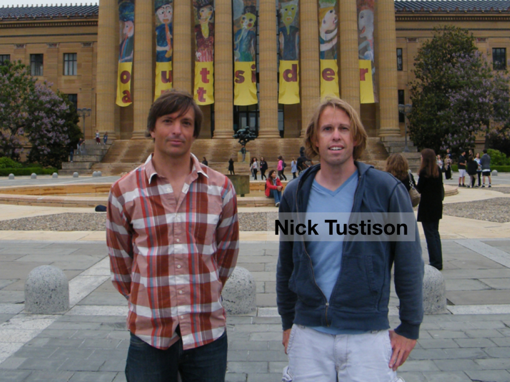
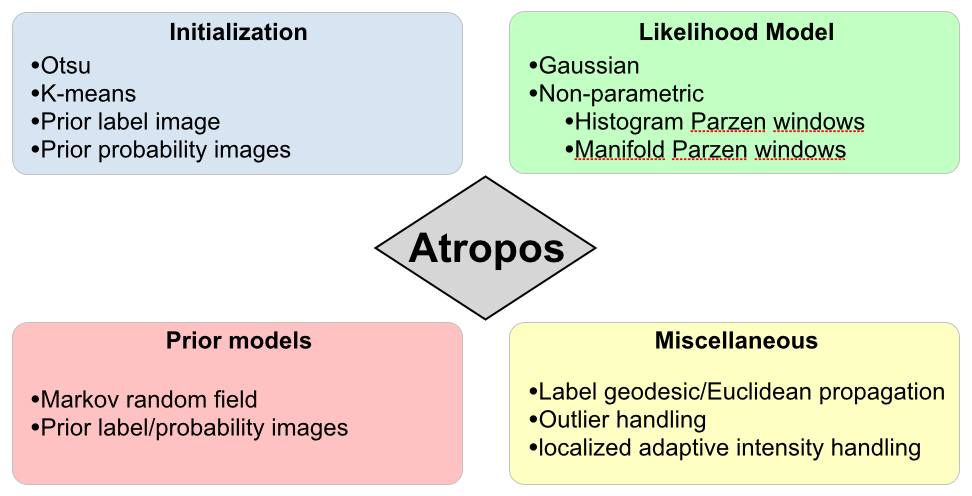
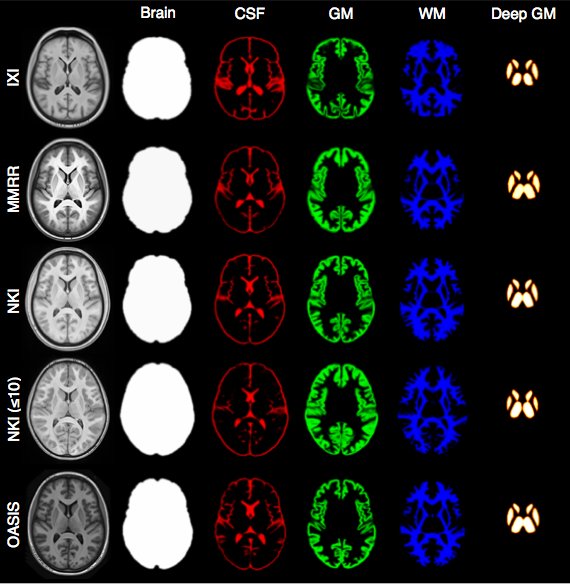
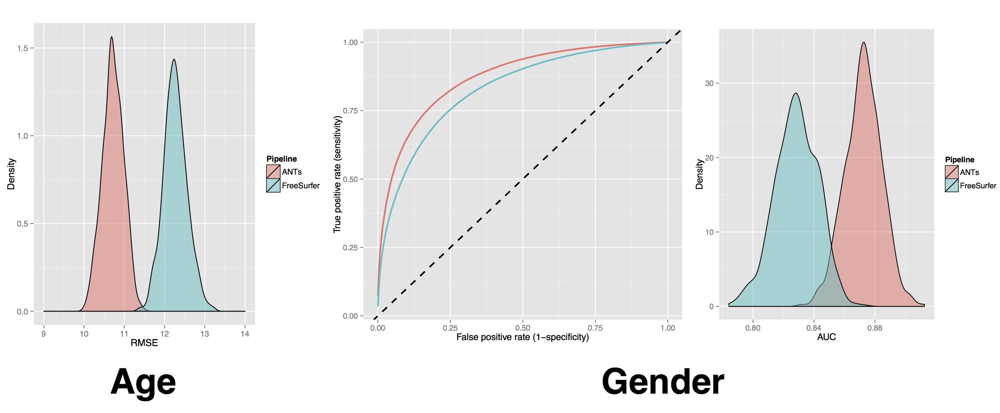

## 
<div align="center"></img></div>


# Background

## Big picture

- Powerful, general-purpose automated or semi-automated registration and segmentation.

- Differentiable maps with differentiable inverse $+$ *statistics in these spaces*

- Customizable multivariate segmentation & registration

- Borg philosophy: from I/O, to processing to statistical methods

- Open source, testing, many examples, consistent style, multiple platforms,  active community support ...

- Integration with *R* $+$ novel tools for prediction, decoding, high-to-low dimensional statistics.

## Applications

- microscopy 

- satellite imagery

- etcetera ...

## Tools you can use for imaging science

- Core developers:  *B. Avants, N. Tustison, H. J. Johnson, J. T. Duda*

- Many contributors, including users ...

- Multi-platform, multi-threaded C++ [stnava.github.io/ANTs](stnava.github.io/ANTs)

- Developed in conjunction with [http://www.itk.org/](http://www.itk.org/)

- R wrapping and extension [stnava.github.io/ANTsR](stnava.github.io/ANTsR)

- rapid development, regular testing $+$ many eyes $\rightarrow$ bugs are shallow


# General theory tunable to specific domains:  *no-free lunch*

## Fine-grained and flexible


# Use prior knowledge to broaden performance

## Mammalian cortical thickness computed with ANTs


# ANTs was begotten in SyN

## Community response

- Just wanted to let you know---ANTS worked for me!  I seem to be getting interesting results along the line_ s of what I was predicting my study would find in specific parts of the striatum.  _--Patryk from Ireland_

- To put not to fine a point on it---ANTS rocks.  _--Craig from California_

- The ANTS package is very, very cool!  _--Jaime from Wisconsin_

- Thank you for sharing this work, and congratulations for a job well done.  _--Alexandra from North Carolina_

## SyN formulation
$$
\begin{aligned}
  \inf_{\phi_1} \inf_{\phi_2}   \Bigg[
                     \int_0^{0.5} & \left( \|v_1(t)\|_L^2 + \|v_2(t)\|_L^2 \right) dt \nonumber \\
                     &+
                     \int_{\Omega} \Pi_{\sim}
                          \left( I \circ \phi_1^{-1}(\mathbf{x},0.5),
                           J \circ \phi_2^{-1}(\mathbf{x},0.5) \right) d\Omega \Bigg]
\end{aligned}
$$
where
$$
\begin{align}
  \frac{d \phi_i(\mathbf{x},t)}{dt} = v_i( \phi_i(\mathbf{x},t), t ),\,\, \phi_i(\mathbf{x},0) = \mathbf{Id}, \,\, i \in \{1,2\}
\end{align}
$$
and $\Pi_{\sim}$ is an arbitrary similarity metric (or metrics).

## SyN for optimization symmetry

Images deform symmetrically along the shape manifold.  This eliminates bias in the
measurement of image differences.

## Minimizing interpolations


$\mathcal{T}_{total} = \mathcal{T}_1 \circ \mathcal{T}_2 \circ \mathcal{T}_3 \circ \mathcal{T}_4$

To avoid compounding interpolation error with the concatenation of transformations, ANTs never
uses more than a single interpolation.

# Library for multivariate image registration, segmentation & statistics

## Anatomical quantification


## Modality integration


# *ITK+ANTs+R = ANTsR*

## Agnostic statistics


## How do we quantify _life span_ brain health in individuals and in populations?


## How do we integrate modalities and organ systems?

need unbrain example here

## ANTs*R* $\rightarrow$ new insight via quantification

Good software should fade into the background ... however ...

<span style="color:yellow;">
 As is common in science, the first big breakthrough in our understanding ...
 [came from] an improvement in measurement.
</span>

<span style="color:pink;">
> Daniel Kahnemann, *Thinking, Fast and Slow* (2011)
</span>


## ANTs v Freesurfer


## SyN Example

<!-- syn example -->

<div align="center"><iframe width="560" height="315" src="http://www.youtube.com/embed/3I9RcRtpOvw" frameborder="0" allowfullscreen></iframe></div>

[SyN video](http://www.youtube.com/embed/3I9RcRtpOvw)

## Theory + evaluation + reproducibility


## Founding Developers


## A long history of research


## Rigorous transformation definition is key

ANTs and ITK are developed together: <span style="color:red;">see @Avants2014, @Tustison2013, @Tustison2010</span> and more ...

Key definitions

- physical space

- transformation definition aware of physical space

- optimization space consistent with above

- unit testing

# Merit Badges

##


## open source

built on ITK—probably the most well-vetted medical image analysis package
in the world  @AvantsITK

## competitions

- Klein 2009:  Brain Registration (ANTs)
- Murphy 2010:  Lung Registration (ANTs)
- SATA 2012:  Multi-Atlas Segmentation (ANTs+JointLabelFusion)
- SATA 2013:  Multi-Atlas Segmentation (ANTs+JointLabelFusion)
- BRATS 2013:  Multivariate Brain Segmentation (ANTsR)
- Yushkevich’s Hipp Atlas:  ( hippocampusubfield.com )
- TBA:  BOLD decoding (ANTsR)
- Substantial work with DTI ( Camino developer in house )
- STACOM2014 ?

## competitions


## papers

- registration : ANTs vs. everything else @Klein2009
- segmentation : Atropos vs. SPM, etc.
- bias correction : N4 vs N3
- cortical thickness : ANTs vs. FreeSurfer @Tustison2014d
- compatibility with R


# The stories behind ANTs development

(we can comment this out but I think it would be good to make some notes for posterity)

## Registration

## N4

* N3 (developed at the Montreal Neurological Institute) has been the gold standard for
bias correction---used in important projects such as ADNI

* N3 is a set of perl scripts that works natively with the MINC file format which we tried
to incorporate into an ANTs processing pipeline.

* We had so much trouble converting back and forth between ITK-compatible Nifti format and
MINC that Brian suggested we try to implement N3 in ITK.

* I had some experience with B-splines and added some other tweaks giving birth to N4.

## N4 Introduction


## Nonparametric nonuniform intensity normalization (N3)

Sled et al., “A nonparametric method for automatic correction of intensity nonuniformity in MRI Data,” _IEEE-TMI_, 17(1), 1998.

***

Boyes et al., “Intensity non-uniformity correction using N3 on 3-T scanners with multichannel phased array coils,” _NeuroImage_, 39(4), 2008.

> In a comparison of several correction techniques N3 performed well (Arnold et al., 2001).
> Also, the algorithm and software are in the public domain
> (http://www.bic.mni.mcgill.ca/software/N3/) and is probably the most widely used non-uniformity
> correction technique in neurological imaging.

Zheng et al., “Improvement of brain segmentation accuracy by optimizing non-uniformity correction using N3,” _NeuroImage_, 48(1), 2009.

> Among existing approaches, the nonparametric non-uniformity intensity normalization method N3
> (Sled et al., 1998) is one of the most frequently used... High performance and robustness have
> practically turned N3 into an industry standard.

Vovk et al., “A Review of Methods for Correction of Intensity Inhomogeneity in MRI,” _IEEE-TMI_, 26(3), 2007.

> A well-known intensity inhomogeneity correction method, known as the N3 (nonparametric
> nonuniformity normalization), was proposed in [15]...  Interestingly, no improvements have
> been suggested for this highly popular and successful method...  The nonparametric
> nonuniformity normalization (N3) method [15] has obviously become the standard method
> against which other methods are compared.

## Code

```
COMMAND:
     N4BiasFieldCorrection

OPTIONS:
     -d, --image-dimensionality 2/3/4
     -i, --input-image inputImageFilename
     -x, --mask-image maskImageFilename
     -w, --weight-image weightImageFilename
     -s, --shrink-factor 1/2/3/4/...
     -c, --convergence [<numberOfIterations=50x50x50x50>,<convergenceThreshold=0.0>]
     -b, --bspline-fitting [splineDistance,<splineOrder=3>]
                           [initialMeshResolution,<splineOrder=3>]
     -t, --histogram-sharpening [<FWHM=0.15>,<wienerNoise=0.01>,<numberOfHistogramBins=200>]
     -o, --output correctedImage
                  [correctedImage,<biasField>]
     -h
     --help
```
> Talk is cheap, show me the code.

## Atropos

* Similar to our experience with N3, we tried to incorporate FAST (from the FMRIB at Oxford)
into an ANTs processing pipeline.

* Phil (?) pointed out the difficulty of incorporating priors into FAST.

* Related, Brian went to a segmentation-related worksop at MICCAI and aired publicly his
disappointment that so much of what had been developed in the community over the last
20+ years has not been made publicly available.  "What's wrong with you people!"

* 3-tissue algorithm in ImageMath ---> multivariate, n-class Atropos

## Atropos components
<div align="center"></img></div>


## KellySlater --> KellyKapowski

## Atropos $+$ KK Example


# Putting it all together

## The ANTs cortical thickness pipeline


[*Large-scale evaluation of ANTs and FreeSurfer cortical thickness measurements*, NeuroImage 2014.*](http://www.ncbi.nlm.nih.gov/pubmed/24879923)

All software components are open source and part of the Advanced Normalization Tools (ANTs) repository.

## Basic components of the pipeline

<div align="center"></img></div>

1. template building (offline)
2. brain extraction
3. cortical thickness estimation
4. cortical parcellation

## Template building

*Tailor data to your specific cohort*

<div align="center"></img></div>

* Templates representing the average mean shape and intensity are built directly from the cohort to be analyzed, e.g. pediatric vs. middle-aged brains.
* Acquisition and anonymization (e.g. defacing) protocols are often different.

## Template building (cont.)

<div align="center"></img></div>

Each template is [processed](https://github.com/ntustison/antsCookTemplatePriorsExample)
to produce auxiliary images which are used for brain extraction and brain segmentation.

## Brain extraction

<div align="center"></img></div>

Comparison with de facto standard FreeSurfer package.  Note the difference in separation of
the gray matter from the surrounding CSF.  (0 failures out of 1205 scans)

## Brain segmentation

<div align="center"></img></div>

Randomly selected healthy individuals.  Atropos gets good performance across ages.

## Cortical thickness estimation

<div align="center"></img></div>

In contrast to FreeSurfer which warps coupled surface meshes to segment the gray matter, ANTs diffeomorphically registers the white matter to the combined gray/white matters while simultaneously estimating thickness.

## Data inspection w/*ANTsR*

spider plots ....

## Evaluation

_Question_:  In the absence of ground truth, how do we evaluate performance?

_Answer_:  We use demographic information with known thickness sensitivity and correlate
with measured thickness quantities.  One of the most well-known, most easily obtained,
and most confident measures available is “age.”  So we take 50% of the thickness data to
train a model (e.g. linear regression) and then calculate the model’s age prediction error
on the other 50%.  We do this for n=1000 permutations to build a distribution.   Similarly,
we can do this for gender.

<div align="center"></img></div>

## A couple notes on usage

* Out of the many cortical thickness algorithms that have been proposed, FreeSurfer dominates.  And rightfully so, because it works well and has been the only publicly available tool (until reccently).
* In the same spirit, we have made our tools publicly available.  Usage is similar to that of FreeSurfer (see below).  We also make several templates available.

<div align="center"></img></div>

“Talk is cheap, show me the code.” <sub>—Linus Torvald</sub>

# Components

## Software engineering

<!-- ants gource -->

<div align="center"><iframe width="560" height="315" src="http://www.youtube.com/embed/7X61iBFDF1I" frameborder="0" allowfullscreen></iframe></div>

[ants gource](http://www.youtube.com/embed/7X61iBFDF1I)

# Analysis philosophy and published opinions

# Voodoo in voxel-based analysis

# Instrumentation bias in the use and evaluation of software

# Discussion

## Problems

There are several problems and shortcomings to this analysis.

- Customizable for specific problems but not too specific
- Latest theoretical advances in registration not yet wrapped for users

## Strengths

Some strengths include relatively few assumptions, a flexible
implementation and open-science approach.

## References {#reffont}

