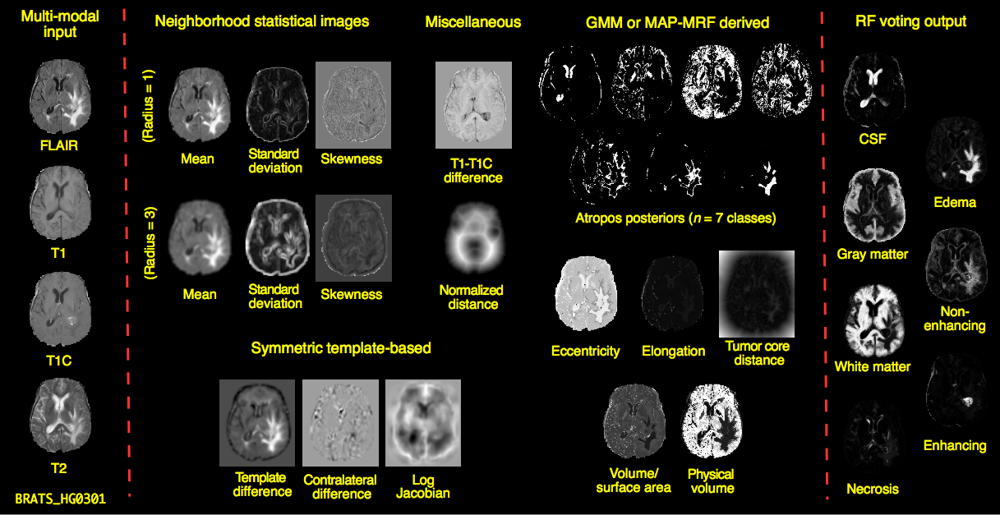
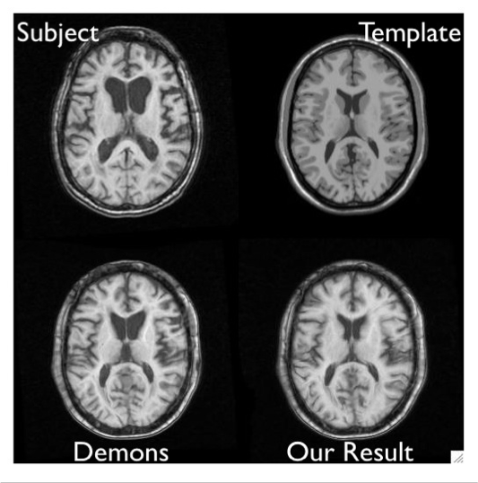
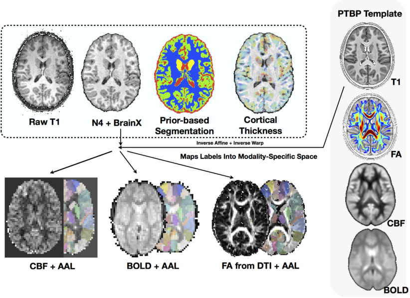
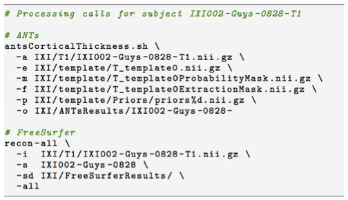

## 
<div align="center"></img></div>

#  ANTs*R* is a platform for <span style="color:red;">reproducible</span> studies of <span style="color:red;">high-dimensional</span> data

#  ANTs*R* is built from general <span style="color:red;">mathematical</span> and <span style="color:red;">software engineering</span> principles

<!--
## Questions driving ANTs development

* how do we compare image pairs? anatomical image pairs?

* what is the pairwise similarity?

* what if this pair has rgb/vector/tensor voxels?

* what does one do with the statistical fields that arise from this mapping?

* how do we extend from pairs to millions of pairs of images?

* how to cluster these statistical fields ... eanat

* how to cluster them when we have supervision .... sccan

* (give examples in R)
-->

## Images are high-dimensional data (SNPs, demographics...)

<div align="center"><iframe width="854" height="510" src="http://www.youtube.com/embed/tEfMBiKp9eE" frameborder="0" allowfullscreen></iframe></div>

[smile movie](http://youtu.be/tEfMBiKp9eE)

we map image pairs with a *transformation* and a *metric*

## coordinated multivariate statistical fields arise from this mapping


## how do we map not just pairs but hundreds or thousands of pairs of images?

## how do we cluster the statistical fields that arise from these maps?

## how do we cluster these fields with supervision and associate clusters with outcomes?

##  <span style="color:red;">ANTs*R*</span> Platform for Medical Imaging


this document [is another goal of ANTs](http://stnava.github.io/ANTsTalk/) as is [this one](http://stnava.github.io/RKRNS/)

## 

- Powerful, general-purpose, <span style="color:red;">well-evaluated</span> registration and segmentation.

- Differentiable maps with differentiable inverse <span style="color:red;">$+$ statistics in these spaces</span>

- Evaluated in multiple problem domains</span> via internal studies & open competition

- Borg philosophy: <span style="color:red;">"best of"</span> from I/O, to processing to statistical methods

- Open source, testing, many examples, consistent style, multiple platforms,  active community support ...

- Integration with *R* $+$ novel tools for prediction, decoding, high-to-low dimensional statistics.

- Collaborations with [neurodebian](http://neuro.debian.net/pkgs/ants.html), [slicer](http://www.slicer.org/), [brainsfit](https://github.com/BRAINSia/BRAINSTools), [nipype](http://nipy.sourceforge.net/nipype/), [itk](http://www.itk.org) and more ...

# Powerful, general-purpose automated or semi-automated registration and segmentation.

## overview


## Geometric transformations


## Intensity transformations


## Fine-grained and flexible maps


## Evaluated on anatomical quantification

<div align="center"></img></div>

## Sata 2013


we provided the *standard* registration results for $>$ 20,000 image pairs at [SATA 2013](https://masi.vuse.vanderbilt.edu/workshop2013/index.php/MICCAI_2013_SATA_Challenge_and_Workshop:Current_events)


# Differentiable maps with differentiable inverse $+$ *statistics in these spaces*

## Brain images as *high-dimensional data*


## Political activism

<div align="center"></img></div>

[congress commentary](http://ntustison.github.io/CongressionalFaceTemplates/)

# Customizable multivariate segmentation & registration

## Mammalian cortical thickness computed with ANTs


## General theory tunable to specific domains:  *no-free lunch*


# Agnostic data integration: prediction, decoding, diagnosis

## *ITK+ANTs+R = ANTsR*

## Agnostic statistics


[McMillan et al.](http://www.ncbi.nlm.nih.gov/pmc/articles/PMC3961542/)

## ANTs*R* $\rightarrow$ new insight via quantification

Good software should fade into the background ... however ...

<span style="color:yellow;">
 As is common in science, the first big breakthrough in our understanding ...
 [came from] an improvement in measurement.
</span>

<span style="color:pink;">
> Daniel Kahnemann, *Thinking, Fast and Slow* (2011)
</span>

# *Questions* & ANTs*R*s

# Can we do a better job of aligning these brains?

##  Brain mapping in the early 2000s was based on Matlab scripts or the *Demons* algorithm



## These approaches over-penalized large deformations and were inadequate for several classes of problems

## Compare chimpanzee and human prefrontal cortex


[LPF algorithm](http://www.ncbi.nlm.nih.gov/pubmed/15948659)


# <span style="color:red;">ANTs was begotten in SyN:</span> "science is the belief in the ignorance of experts"

## SyN formulation
$$
\begin{aligned}
  \inf_{\phi_1} \inf_{\phi_2}   \Bigg[
                     \int_0^{0.5} & \left( \|v_1(t)\|_L^2 + \|v_2(t)\|_L^2 \right) dt \nonumber \\
                     &+
                     \int_{\Omega} \Pi_{\sim}
                          \left( I \circ \phi_1^{-1}(\mathbf{x},0.5),
                           J \circ \phi_2^{-1}(\mathbf{x},0.5) \right) d\Omega \Bigg]
\end{aligned}
$$
where
$$
  \frac{d \phi_i(\mathbf{x},t)}{dt} = v_i( \phi_i(\mathbf{x},t), t ),\,\, \phi_i(\mathbf{x},0) = \mathbf{Id}, \,\, i \in \{1,2\}
$$
and $\Pi_{\sim}$ is an arbitrary similarity metric (or metrics).

## SyN for optimization symmetry

Images deform symmetrically along the shape manifold.  This eliminates bias in the
measurement of image differences.

## Minimizing interpolations


$\mathcal{T}_{total} = \mathcal{T}_1 \circ \mathcal{T}_2 \circ \mathcal{T}_3 \circ \mathcal{T}_4$

To avoid compounding interpolation error with the concatenation of transformations, ANTs never
uses more than a single interpolation.

## SyN Example

<!-- syn example -->

<div align="center"><iframe width="560" height="315" src="http://www.youtube.com/embed/3I9RcRtpOvw" frameborder="0" allowfullscreen></iframe></div>

[SyN movie](http://www.youtube.com/embed/3I9RcRtpOvw)

## SyGN - templates and averages in deformation space


from [miykael](http://miykael.github.io/nipype-beginner-s-guide/ANTS.html)

[geodesic image averages](http://www.ncbi.nlm.nih.gov/pubmed/15501083)

[optimal templates 2](http://www.ncbi.nlm.nih.gov/pubmed/19818860)

[canine template](http://www.ncbi.nlm.nih.gov/pubmed/23284904)

[chimpanzees](http://www.ncbi.nlm.nih.gov/pubmed/23516289)

# Can we improve segmentation in "challenging" populations?

##  Segmentation Framework 

1. Bias correction (with optional priors)

2. Prior-based tissue segmentation

3. Prior-based anatomical labeling 

4. Iteration through above steps (optional)

## We tried N3 and FSL-FAST for these problems ... and *dislike* Matlab ...

failed to locate well-implemented open-source resources for general purpose prior-based 
segmentation and inhomogeneity correction ...

## N4

* N3 (developed at the Montreal Neurological Institute) has been the gold standard for
bias correction---used in important projects such as ADNI

* N3 is a set of perl scripts that works natively with the MINC file format which we tried
to incorporate into an ANTs processing pipeline.

* We had so much trouble converting back and forth between ITK-compatible Nifti format and
MINC that BA suggested we try to implement N3 in ITK.

* NT had some experience with B-splines and added some other tweaks giving birth to N4.

## N4 Introduction


## Nonparametric nonuniform intensity normalization (N3)

Sled et al., “A nonparametric method for automatic correction of intensity nonuniformity in MRI Data,” _IEEE-TMI_, 17(1), 1998.

***

Boyes et al., “Intensity non-uniformity correction using N3 on 3-T scanners with multichannel phased array coils,” _NeuroImage_, 39(4), 2008.

> In a comparison of several correction techniques N3 performed well (Arnold et al., 2001).
> Also, the algorithm and software are in the public domain
> (http://www.bic.mni.mcgill.ca/software/N3/) and is probably the most widely used non-uniformity
> correction technique in neurological imaging.

Zheng et al., “Improvement of brain segmentation accuracy by optimizing non-uniformity correction using N3,” _NeuroImage_, 48(1), 2009.

> Among existing approaches, the nonparametric non-uniformity intensity normalization method N3
> (Sled et al., 1998) is one of the most frequently used... High performance and robustness have
> practically turned N3 into an industry standard.

Vovk et al., “A Review of Methods for Correction of Intensity Inhomogeneity in MRI,” _IEEE-TMI_, 26(3), 2007.

> A well-known intensity inhomogeneity correction method, known as the N3 (nonparametric
> nonuniformity normalization), was proposed in [15]...  Interestingly, no improvements have
> been suggested for this highly popular and successful method...  The nonparametric
> nonuniformity normalization (N3) method [15] has obviously become the standard method
> against which other methods are compared.

## Code

```
COMMAND:
     N4BiasFieldCorrection

OPTIONS:
     -d, --image-dimensionality 2/3/4
     -i, --input-image inputImageFilename
     -x, --mask-image maskImageFilename
     -w, --weight-image weightImageFilename
     -s, --shrink-factor 1/2/3/4/...
     -c, --convergence [<numberOfIterations=50x50x50x50>,<convergenceThreshold=0.0>]
     -b, --bspline-fitting [splineDistance,<splineOrder=3>]
                           [initialMeshResolution,<splineOrder=3>]
     -t, --histogram-sharpening [<FWHM=0.15>,<wienerNoise=0.01>,<numberOfHistogramBins=200>]
     -o, --output correctedImage
                  [correctedImage,<biasField>]
     -h
     --help
```
> Talk is cheap, show me the code.


##  Atropos: Bayesian $N$-class multivariate segmentation 

* Similar to our experience with N3, we tried to incorporate FAST (from the FMRIB at Oxford)
into an ANTs processing pipeline.

* We failed to successfully incorporate priors into FAST.

* Related, BA went to a segmentation-related worksop at MICCAI and
aired disappointment that so much of what had been developed in the
community over the last 20+ years has not been made publicly
available.  "What's wrong with you people!"

* 3-tissue algorithm in ImageMath $\rightarrow$ multivariate, n-class Atropos

## Atropos components
<div align="center"></img></div>


# Can we accurately measure cortical thickness by DiReCTly using the image space?

## KellySlater $\rightarrow$ KellyKapowski


Several years of development by SR Das, BA, NT (KK fan)

## Atropos $+$ KK Example


## FTD

## Babies


# Can we quantify _life span_ brain health in individuals and in populations?

## "Big data" problem from public resources


TOT, NKI, IXI, Oasis, ADNI ... several thousand images

## The Glove: Comparison with Freesurfer

_Question_:  In the absence of ground truth, how do we evaluate performance?

_Answer_:  Use prediction of demographics from quantitative cortical thickness data as a reference for the power of our methods.  One of the most well-known, most easily obtained,
and most confident measures available is “age.”  So we take 50% of the thickness data to
train a model (e.g. linear regression) and then calculate the model’s age prediction error
on the other 50%.  We do this for n=1000 permutations to build a distribution.   Similarly,
we can do this for gender.

## ANTS vs Freesurfer

<div align="center"></img></div>

## ANTs vs Freesurfer 2


## ANTs MALF Labeling


## The ANTs structural brain mapping pipeline


[*Large-scale evaluation of ANTs and FreeSurfer cortical thickness measurements*, NeuroImage 2014.*](http://www.ncbi.nlm.nih.gov/pubmed/24879923)

All software components are open source and part of the Advanced Normalization Tools (ANTs) repository.

## Basic components of the pipeline

<div align="center"></img></div>

1. template building (offline)
2. brain extraction
3. cortical thickness estimation
4. cortical parcellation

## Template building

*Tailor data to your specific cohort*

<div align="center"></img></div>

* Templates representing the average mean shape and intensity are built directly from the cohort to be analyzed, e.g. pediatric vs. middle-aged brains.
* Acquisition and anonymization (e.g. defacing) protocols are often different.

## Template building (cont.)

<div align="center"></img></div>

Each template is [processed](https://github.com/ntustison/antsCookTemplatePriorsExample)
to produce auxiliary images which are used for brain extraction and brain segmentation.

## Brain extraction

<div align="center"></img></div>

Comparison with de facto standard FreeSurfer package.  Note the difference in separation of
the gray matter from the surrounding CSF.  (0 failures out of 1205 scans)

## Brain segmentation

<div align="center"></img></div>

Randomly selected healthy individuals.  Atropos gets good performance across ages.

## Cortical thickness estimation

<div align="center"></img></div>

In contrast to FreeSurfer which warps coupled surface meshes to segment the gray matter, ANTs diffeomorphically registers the white matter to the combined gray/white matters while simultaneously estimating thickness.


# Can we implement and release, with provenance, a multiple modality MRI map of adolescent brain development from public MRI data?

## Scientific Data 2014



# Can we customize these methods for a challenging multivariate segmentation problem with clinical relevance?

## BRATS 2013

# Can we address subtle questions in brain and cognition via imaging-specific dimensionality reduction?

##  [Eigenanatomy](http://www.ncbi.nlm.nih.gov/pubmed/24852460) & [SCCAN](http://www.ncbi.nlm.nih.gov/pubmed/?term=avants+SCCAN)


# Discussion

## Problems

- Customizable for specific problems but not too specific
- Rapid development: still need familiarity with compilation for latest ANTs
- Latest theoretical advances in registration not yet wrapped for users
- Need more [Documentation](http://stnava.github.io/ANTs/)  & [testing](http://testing.psychiatry.uiowa.edu/CDash/index.php?project=ANTS) ...


## Solid Core Permits Broad Applications

- microscopy 

- satellite imagery

- interactive registration (see *Slicer*) and segmentation (see *ITK-SNAP*)


## Community response

- Just wanted to let you know---ANTS worked for me!  I seem to be getting interesting results along the line_ s of what I was predicting my study would find in specific parts of the striatum.  _--Patryk from Ireland_

- To put not to fine a point on it---ANTS rocks.  _--Craig from California_

- The ANTS package is very, very cool!  _--Jaime from Wisconsin_

- Thank you for sharing this work, and congratulations for a job well done.  _--Alexandra from North Carolina_

## Strengths

Some strengths include relatively few assumptions, a flexible
implementation and open-science approach.


## Tools you can use for imaging science

- Core developers:  *B. Avants, N. Tustison, H. J. Johnson, J. T. Duda*

- Many contributors, including users ...

- Multi-platform, multi-threaded C++ [stnava.github.io/ANTs](stnava.github.io/ANTs)

- Developed in conjunction with [http://www.itk.org/](http://www.itk.org/)

- R wrapping and extension [stnava.github.io/ANTsR](stnava.github.io/ANTsR)

- rapid development, regular testing $+$ many eyes $\rightarrow$ bugs are shallow


## competitions

- Klein 2009:  Brain Registration (ANTs)
- Murphy 2010:  Lung Registration (ANTs)
- SATA 2012:  Multi-Atlas Segmentation (ANTs+JointLabelFusion)
- SATA 2013:  Multi-Atlas Segmentation (ANTs+JointLabelFusion)
- BRATS 2013:  Multivariate Brain Segmentation (ANTsR)
- Yushkevich’s Hipp Atlas:  ( hippocampusubfield.com )
- TBA:  BOLD decoding (ANTsR)
- Substantial work with DTI ( Camino developer in house )
- STACOM2014 ?

## 


## Data inspection w/*ANTsR*

spider plots ....

## A couple notes on usage

* Out of the many cortical thickness algorithms that have been proposed, FreeSurfer dominates.  And rightfully so, because it works well and has been the only publicly available tool (until reccently).
* In the same spirit, we have made our tools publicly available.  Usage is similar to that of FreeSurfer (see below).  We also make several templates available.

<div align="center"></img></div>

“Talk is cheap, show me the code.” <sub>—Linus Torvald</sub>


## Software engineering

<!-- ants gource -->

<div align="center"><iframe width="560" height="315" src="http://www.youtube.com/embed/7X61iBFDF1I" frameborder="0" allowfullscreen></iframe></div>

[ants gource](http://www.youtube.com/embed/7X61iBFDF1I)


# Library for multivariate image registration, segmentation & statistics


## Theory + evaluation + reproducibility


## Founding Developers


## A long history of research


## Rigorous transformation definition is key

ANTs and ITK are developed together: <span style="color:red;">see @Avants2014, @Tustison2013, @Tustison2010</span> and more ...

Key definitions

- physical space

- transformation definition aware of physical space

- optimization space consistent with above

- unit testing

# Merit Badges

##


## open source

built on ITK—probably the most well-vetted medical image analysis package
in the world  @AvantsITK

## papers

- registration : ANTs vs. everything else @Klein2009
- segmentation : Atropos vs. SPM, etc.
- bias correction : N4 vs N3
- cortical thickness : ANTs vs. FreeSurfer @Tustison2014d
- compatibility with R

# Analysis philosophy and published opinions

## What is and *is not* image registration

[*not* registration](http://www.ncbi.nlm.nih.gov/pubmed/23116330)

## Voodoo in voxel-based analysis

[logical circularity VBA](http://www.ncbi.nlm.nih.gov/pubmed/?term=logical+circularity+tustison)

## Instrumentation bias in the use and evaluation of software

[Instrumentation bias in the use and evaluation of software](http://www.ncbi.nlm.nih.gov/pmc/articles/PMC3766821/?report=reader)


## References {#reffont}

