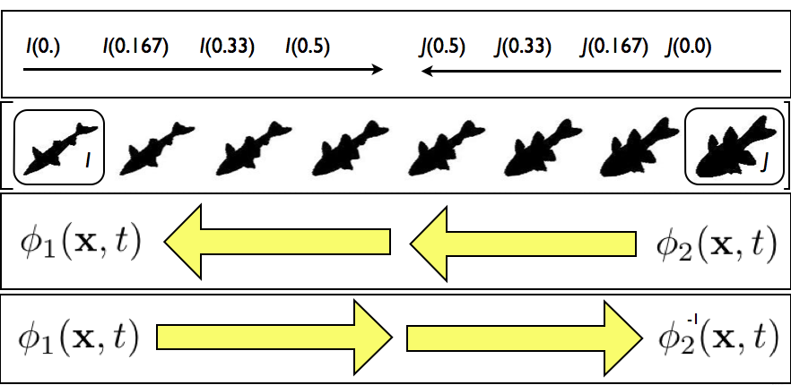
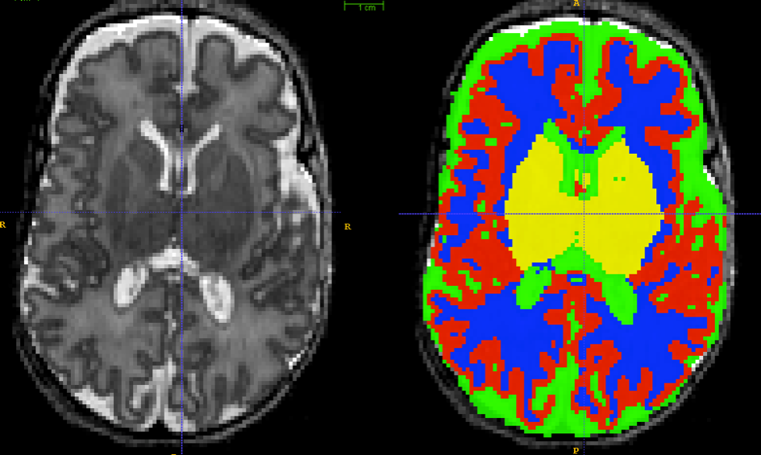
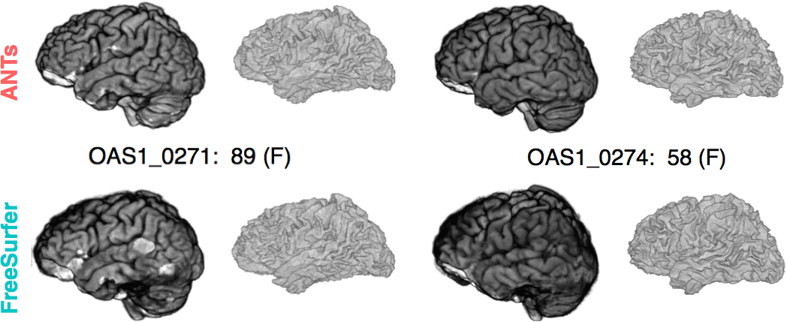
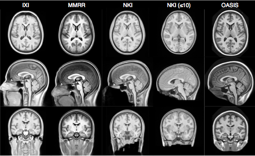
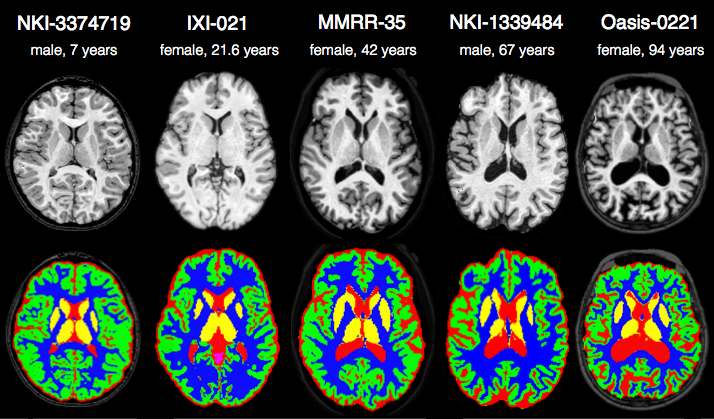
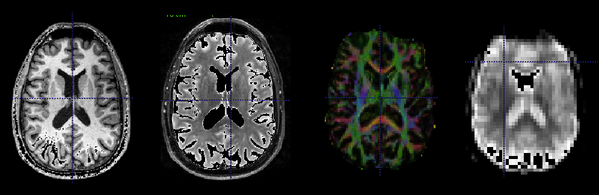

```{r global options, include=FALSE}
library(rmarkdown)
library(knitr)
figpath<-'FigsAntsHistory/'
opts_chunk$set(fig.width=9, fig.height=6, fig.path=figpath,
               warning=FALSE, message=FALSE)
```
## 
<div align="center"></img></div>

This talk is online at [http://stnava.github.io/ANTsTalk/](http://stnava.github.io/ANTsTalk/#/) with colored [links](http://stnava.github.io/ANTsTalk/#/) meant to be clicked for more information


## Image mapping & perception: 1878


* Francis Galton: Can we see criminality in the face?

* (maybe he should have used ANTs?)


## Founding developers

<div align="center"></img></div>


## Long-term collaborators


$+$ [neurodebian](http://neuro.debian.net/pkgs/ants.html), [slicer](http://www.slicer.org/), [brainsfit](https://github.com/BRAINSia/BRAINSTools), [nipype](http://nipy.sourceforge.net/nipype/), [itk](http://www.itk.org) and more ...

## General purpose library for multivariate image registration, segmentation & statistical analysis tools

* 170,000+ lines of C++, 6$+$ years of work, 15+ collaborators. 

* Generic mathematical methods that are tunable for 
application specific domains:  no-free lunch

* Deep testing on multiple platforms ... osx, linux, windows.

* Several "wins" in public knock-abouts ( [Klein 2009](http://www.ncbi.nlm.nih.gov/pubmed/19195496), [Murphy 2011](http://www.ncbi.nlm.nih.gov/pubmed/21632295), [SATA 2012 and 2013](http://www.ncbi.nlm.nih.gov/pmc/articles/PMC3837555/), [BRATS 2013](http://martinos.org/qtim/miccai2013/proc_brats_2013.pdf), others ) 

```
    An algorithm must use prior knowledge about a problem 
    to do well on that problem 
```

# *ANTs* optimizes mathematically well-defined <span style="color:red;">objective functions</span> guided by <span style="color:red;">prior knowledge</span>  ...

# ... including that of developers, domain experts and other colleagues ...

# plug *your ideas* into our software to gain insight into biomedical data ...

# our strong <span style="color:red;">mathematical and software engineering</span> foundation leads to near limitless opportunities for innovation in a variety of application domains
 
## ANTs is *open* to different image types, multiple modalities, anatomical regions, segmentation priors, etc.

## ANTs & Neuroscience

We need statistical image analysis <br />at several scales in modern neuroscience

* Macro: *in vivo* structural and functional MRI

* Micro:  high-resolution post-mortem MRI links with in vivo MRI

* Nano: neuron reconstruction ...

* Solutions that are consistent across these scales have the potential
to build multi-scale feature sets or templates and provide new
insights into brain structure and function

* E.g. Parcellation constraints based on histology, tractography, function ...

* Statistical definitions of anatomy/pathology?  

* Reinvention of these solutions within each lab ... can we mitigate this?

* Reduce, reuse, recycle ...


## ANTs Lineage 


References: @Horn1981, @Gee1993, @Grenander1993, @Thompson2001, @Miller2002, @Shen2002, @Arnold2014, @Thirion1998, @Rueckert1999, @Fischl2012, @Ashburner2012

## Diffeomorphisms

<div align="center"></img></div>

plausible physical modeling of large, invertible deformations

"differentiable map with differentiable inverse"

## Fine-grained and flexible maps


## ANTs: Beyond Registration


[Atropos](http://www.ncbi.nlm.nih.gov/pubmed/?term=atropos+tustison) segmentation, [N4 inhomogeneity correction](http://www.ncbi.nlm.nih.gov/pubmed/?term=N4+tustison), [Eigenanatomy](http://www.ncbi.nlm.nih.gov/pubmed/?term=eigenanatomy+avants), [SCCAN](http://www.ncbi.nlm.nih.gov/pubmed/?term=sparse+canonical+avants), [Prior-constrained PCA](http://www.ncbi.nlm.nih.gov/pubmed/24852460), and [atlas-based label fusion](http://www.ncbi.nlm.nih.gov/pmc/articles/PMC4009425/) and [MALF](http://www.ncbi.nlm.nih.gov/pubmed/21237273) (powerful expert systems for segmentation)

## Definitions

* Registration $=$ estimate an "optimal" geometric mapping between image pairs or image sets (e.g. Affine)

* Similarity $=$ a function relating one image to another, given a transformation (e.g. mutual information)

* <span style="color:grey;">
Diffeomorphisms $=$ differentiable map with differentiable inverse (e.g. "silly putty", viscous fluid)  </span>

* Segmentation $=$ labeling tissue or anatomy in images, usually automated (e.g. K-means)

* <span style="color:grey;"> Multivariate $=$ using many voxels or measurements at once (e.g. PCA, $p >> n$ ridge regression)</span>

* Multiple modality $=$ using many modalities at once (e.g. DTI and T1 and BOLD)

* MALF: multi-atlas label fusion - using anatomical dictionaries to label new data

* Solutions to challenging statistical image processing problems usually need elements from each of the above 


# <span style="color:red;">Medical Image Registration</span> <br /> Fundamental tool for<br /> morphometry, segmentation,<br /> motion estimation and <br /> <span style="color:blue;">data cleaning</span>

# we *can* compare<br /> <span style="color:red;">apples</span> and <span style="color:orange;">oranges</span> ... 

## apples and oranges ... 


initialization

## apples and oranges ... 


<span style="color:red;">R</span><span style="color:green;">G</span><span style="color:blue;">B</span> affine

## apples and oranges ... 


<span style="color:red;">R</span><span style="color:green;">G</span><span style="color:blue;">B</span> deformable registration - i.e. registration on color

## The Technical Framework


... and most of it multivariate.

## ANTs Nomenclature / Standards 


## ANTs Nomenclature / Standards 


## ANTs Nomenclature / Standards 


## ANTs Nomenclature / Standards 


 
## The optimization problem

Find mapping $$ \color{red}{ \phi(x,p) \in \mathcal{T} }$$ such that

$$ \color{red}{ M(I,J,\phi(x,p)) } $$ is minimized

Must select both metric $\color{red}{M}$ and transformation $\color{red}{\mathcal{T}}$

... in addition to optimizer and the problem's resolution

Discussed in more detail [in this frontiers paper](http://www.ncbi.nlm.nih.gov/pubmed/24817849)


## The *A*-team of similarity metrics


$$ \| I - J \| ~~~~~~~~~~~~~~~~~~~ \frac{< I, J >}{\|I\|\|J\|} ~~~~~~~~~~~~~~~ p(I,J) log \frac{p(I,J)}{p(I)p(J)}$$

**all metrics** may be computed from **sparse** or **dense** samples and used with low or high-dimensional transformations

[our research on similarity metrics for brain registration](http://www.ncbi.nlm.nih.gov/pmc/articles/PMC3065962/)

## [SyN](http://www.ncbi.nlm.nih.gov/pmc/articles/PMC2276735/) for optimization symmetry

Images deform symmetrically along the shape manifold.  This eliminates bias in the
measurement of image differences.

##  [SyN (link)](http://www.ncbi.nlm.nih.gov/pmc/articles/PMC2276735/) Example

<!-- syn example -->

<div align="center"><iframe width="1120" height="630" src="http://www.youtube.com/embed/3I9RcRtpOvw" frameborder="0" allowfullscreen></iframe></div>

[SyN movie](http://www.youtube.com/embed/3I9RcRtpOvw)


## Concatenated transformation $+$ metric stages are necessary in real data

0.  Initialize the mapping ( more on this later )

1.  Start with a *rigid transformation*:  $I(x) \approx J(R(x))$ s.t. negative $MI$ is minimized

2.  Follow by an *affine transformation*:  $I(x) \approx J(R(A(x)))$ s.t. negative $MI$ is minimized with fixed $R$

3.  Finally, a *diffeomorphism*:  $I(x) \approx J(R(A(\phi(x))))$ s.t. $k$-neighborhood correlation $CC_k$ is minimized with fixed $R, A$

4.  Output the *composite transform* $A \circ R$ as a matrix transformation and $\phi$ and $\phi^{-1}$ as deformation fields.

standard in [recommended](http://stnava.github.io/ANTsDoc/) `antsRegistration` application scripts 

## Minimizing interpolations


$\mathcal{T}_{total} = \mathcal{T}_1 \circ \mathcal{T}_2 \circ \mathcal{T}_3 \circ \mathcal{T}_4$

To avoid compounding interpolation error with the concatenation of transformations, *ANTs* never
uses more than a single interpolation.

We ported many of these ideas into the [Insight ToolKit](http://www.itk.org) <br /> as part of its [V4 reboot](http://journal.frontiersin.org/Journal/10.3389/fninf.2014.00044/abstract)!

## Registration benefits from<br /> *optimal sampling strategy*

* sampling for *both* the metric and the transformation

* impacts scalability, memory, optimization accuracy, speed, robustness ...

* could be done optimally *with massive improvements in performance*
    * but needs investment in order to achieve "dream" registration scenario

* important for new schemes that *elect* solutions from **anatomical or transformation** dictionaries

* overall, relatively little translational work on this important problem in biomedical imaging

## Sampling & feature selection: Multi-start


Theoretical guarantee of global optimum: improves local optimizers.

Default in `antsCorticalThickness` pipeline and `FSL`.

## Sampling & feature selection: Biomedical imagery


Initial configuration of data

## Sampling & feature selection: Biomedical imagery


Automatic feature selection

## Sampling & feature selection: Biomedical imagery


Resampling allows comparison & slide alignment and <br />
validates the feature selection

Dramatic reduction in computation time / memory requirements

## Sampling & feature selection: Lesioned brains


## Sampling & feature selection: Summary

* we exploit these strategies to:
    - accelerate
    - focus 
    - validate


# Differentiable maps with<br /> differentiable inverse <br />$+$ *statistics in these spaces*

## Brain templates as *high-dimensional averages*


## SyGN - templates and averages in deformation space


from [miykael](http://miykael.github.io/nipype-beginner-s-guide/ANTS.html)

[geodesic image averages](http://www.ncbi.nlm.nih.gov/pubmed/15501083)

[optimal templates 2](http://www.ncbi.nlm.nih.gov/pubmed/19818860)

[canine template](http://www.ncbi.nlm.nih.gov/pubmed/23284904)

[chimpanzees](http://www.ncbi.nlm.nih.gov/pubmed/23516289)


## Statistics in deformation space

[AIBS movie](http://www.youtube.com/embed/8GgHG-rApiE)


## Average Republican and Democratic congressmen

<div align="center"></img></div>

[congress](http://ntustison.github.io/CongressionalFaceTemplates/)

## We build templates to *store* and *transfer* prior knowledge 

##  Segmentation Framework 

1. Bias correction (with optional priors)

2. Prior-based tissue segmentation

3. Prior-based anatomical labeling 

4. Iteration through above steps (optional)

## We tried N3 and FSL-FAST for these problems ... and *dislike* Matlab ...

failed to locate well-implemented open-source resources for general purpose prior-based 
segmentation and inhomogeneity correction ...

##  Atropos: Bayesian $N$-class multivariate segmentation 

* Similar to our experience with N3, we tried to incorporate FAST (from the FMRIB at Oxford)
into an *ANTs* processing pipeline.

* We failed to successfully incorporate priors into FAST.

* Related, BA went to a segmentation-related worksop at MICCAI and
aired disappointment that so much of what had been developed in the
community over the last 20+ years has not been made publicly
available.  "What's wrong with you people!"

* 3-tissue algorithm in ImageMath $\rightarrow$ multivariate, n-class Atropos

## Atropos components
<div align="center"></img></div>

## Babies




# Can we accurately measure cortical thickness by DiReCTly using the image space?

## KellySlater $\rightarrow$ KellyKapowski


Several years of development by SR Das, BA, NT (KK fan)

## Atropos $+$ KK Example


## N4

* N3 (developed at the Montreal Neurological Institute) has been the gold standard for
bias correction---used in important projects such as ADNI

* N3 is a set of perl scripts that works natively with the MINC file format which we tried
to incorporate into an *ANTs* processing pipeline.

* We had so much trouble converting back and forth between ITK-compatible Nifti format and
MINC that BA suggested we try to implement N3 in ITK.

* NT had some experience with B-splines and added some other tweaks giving birth to N4.

## N4 Introduction


## Nonparametric nonuniform intensity normalization (N3)

Sled et al., “A nonparametric method for automatic correction of intensity nonuniformity in MRI Data,” _IEEE-TMI_, 17(1), 1998.

***

Boyes et al., “Intensity non-uniformity correction using N3 on 3-T scanners with multichannel phased array coils,” _NeuroImage_, 39(4), 2008.

> In a comparison of several correction techniques N3 performed well (Arnold et al., 2001).
> Also, the algorithm and software are in the public domain
> (http://www.bic.mni.mcgill.ca/software/N3/) and is probably the most widely used non-uniformity
> correction technique in neurological imaging.

Zheng et al., “Improvement of brain segmentation accuracy by optimizing non-uniformity correction using N3,” _NeuroImage_, 48(1), 2009.

> Among existing approaches, the nonparametric non-uniformity intensity normalization method N3
> (Sled et al., 1998) is one of the most frequently used... High performance and robustness have
> practically turned N3 into an industry standard.

Vovk et al., “A Review of Methods for Correction of Intensity Inhomogeneity in MRI,” _IEEE-TMI_, 26(3), 2007.

> A well-known intensity inhomogeneity correction method, known as the N3 (nonparametric
> nonuniformity normalization), was proposed in [15]...  Interestingly, no improvements have
> been suggested for this highly popular and successful method...  The nonparametric
> nonuniformity normalization (N3) method [15] has obviously become the standard method
> against which other methods are compared.

## Code

```
COMMAND:
     N4BiasFieldCorrection

OPTIONS:
     -d, --image-dimensionality 2/3/4
     -i, --input-image inputImageFilename
     -x, --mask-image maskImageFilename
     -w, --weight-image weightImageFilename
     -s, --shrink-factor 1/2/3/4/...
     -c, --convergence [<numberOfIterations=50x50x50x50>,<convergenceThreshold=0.0>]
     -b, --bspline-fitting [splineDistance,<splineOrder=3>]
                           [initialMeshResolution,<splineOrder=3>]
     -t, --histogram-sharpening [<FWHM=0.15>,<wienerNoise=0.01>,<numberOfHistogramBins=200>]
     -o, --output correctedImage
                  [correctedImage,<biasField>]
     -h
     --help
```
> Talk is cheap, show me the code.


## Joint Label Fusion 

FIXME 

Use dictionaries to labels


# Evaluation results

## 


## Anatomical dictionaries


we provided the *standard* registration results for $>$ 20,000 image pairs at [SATA 2013](https://masi.vuse.vanderbilt.edu/workshop2013/index.php/MICCAI_2013_SATA_Challenge_and_Workshop:Current_events)

## [label fusion (link)](http://www.ncbi.nlm.nih.gov/pmc/articles/PMC3049832/)


## Multiple metrics improve performance


to our knowledge, ANTs is the only freely available system that can solve this problem in a fully multivariate manner.

Hongzhi Wang won the "walk in the park" award for this work ...


# ANTs versus Freesurfer:<br />  Quantifying *life span* brain health

## "Big data" problem from public resources


TOT, NKI, IXI, Oasis, ADNI ... several thousand images


## ANTs versus Freesurfer:<br />  Quantifying *life span* brain health

* Freesurfer is the historical standard for measuring cortical thickness

* instead of using surfaces to measure cortical thickness, we use the image space *DiReCTly*

* [see this section of a different talk](http://stnava.github.io/ANTsTalk/#/putting-it-all-together-can-we-quantify-life-span-brain-health-in-individuals-and-in-populations) 

* and this "big data" paper: [Large-scale evaluation of ANTs and FreeSurfer cortical thickness measurements](http://www.ncbi.nlm.nih.gov/pubmed/24879923)

* comparison of prediction from automated cortical thickness measurement from 4 public datasets

* $>$ 1200 subjects, age 7 to over 90 years old

* *hint*: ANTs thickness measurements have higher prediction accuracy relative to Freesurfer ( implying we extract more information from the data )

* ANTs methods consistently improve statistical power [eigenanatomy](http://www.ncbi.nlm.nih.gov/pubmed/24687814), [syn](http://www.ncbi.nlm.nih.gov/pubmed/?term=syn+epstein+avants), [itkv4](http://www.ncbi.nlm.nih.gov/pubmed/24817849) ... also, see [Schwarz CG, et al.](http://www.ncbi.nlm.nih.gov/pubmed/24650605) re: TBSS and related work in fMRI [Miller, PNAS](http://www.ncbi.nlm.nih.gov/pubmed/15980148), [Azab, et al in Hippocampus](http://www.ncbi.nlm.nih.gov/pubmed/24167043).

## ANTS vs Freesurfer

<div align="center"></img></div>

## *ANTs* vs Freesurfer 2


## *ANTs* MALF Labeling


## The *ANTs* structural brain mapping pipeline


[*Large-scale evaluation of *ANTs* and FreeSurfer cortical thickness measurements*, NeuroImage 2014.*](http://www.ncbi.nlm.nih.gov/pubmed/24879923)

All software components are open source and part of the Advanced Normalization Tools (ANTs) repository.

## Basic components of the pipeline

<div align="center"></img></div>

1. template building (offline)
2. brain extraction
3. cortical thickness estimation
4. cortical parcellation

## Template building

*Tailor data to your specific cohort*

<div align="center"></img></div>

* Templates representing the average mean shape and intensity are built directly from the cohort to be analyzed, e.g. pediatric vs. middle-aged brains.
* Acquisition and anonymization (e.g. defacing) protocols are often different.

## Template building (cont.)

<div align="center"></img></div>

Each template is [processed](https://github.com/ntustison/antsCookTemplatePriorsExample)
to produce auxiliary images which are used for brain extraction and brain segmentation.

## Brain extraction

<div align="center"></img></div>

Comparison with de facto standard FreeSurfer package.  Note the difference in separation of
the gray matter from the surrounding CSF.  (0 failures out of 1205 scans)

## Brain segmentation

<div align="center"></img></div>

Randomly selected healthy individuals.  Atropos gets good performance across ages.

## Cortical thickness estimation

<div align="center"></img></div>

In contrast to FreeSurfer which warps coupled surface meshes to segment the gray matter, *ANTs* diffeomorphically registers the white matter to the combined gray/white matters while simultaneously estimating thickness.


# Registration & statistics:<br /> Frontiers and innovation

## multivariate statistical fields arise from fused modalities



*Many opportunities for statistical advancements*

## Scientific Data 2014


## "Network" of predictors for age

...


## ITK+ANTs+R = <span style="color:red;">*ANTsR*</span>

## Agnostic statistics


[McMillan et al.](http://www.ncbi.nlm.nih.gov/pmc/articles/PMC3961542/)

## A Quick <span style="color:grey;">*ANTsR*</span> example
```{r loadantsr,results='hide',echo=FALSE,message=FALSE}
library(ANTsR)
```

This is an executable *ANTsR* code block - *N*-dimensional statistics to go with 
our *N*-dimensional image processing software!
```{r loadimages,message=FALSE,warning=FALSE,results='hide'}
library(ANTsR)
dim<-2
filename<-getANTsRData('r16')
img<-antsImageRead( filename , dim )
filename<-getANTsRData('r64')
img2<-antsImageRead( filename , dim )
mask<-getMask(img,50,max(img),T)
mask2<-getMask(img,150,max(img),T)
nvox<-sum( mask == 1 )
nvox2<-sum( mask2 == 1 )
```
The brain has `r nvox` voxels ...

## A Quick <span style="color:grey;">*ANTsR*</span> example

Simulate a population morphometry study - a "VBM" ...
```{r morph,results='hide'}
simnum<-10
imglist<-list()
imglist2<-list()
for ( i in 1:simnum ) {
  img1sim<-antsImageClone(img)
  img1sim[ mask==1 ]<-rnorm(nvox,mean=0.5)
  img1sim[ mask2==1 ]<-rnorm(nvox2,mean=2.0)
  img2sim<-antsImageClone(img2)
  img2sim[ mask==1 ]<-rnorm(nvox,mean=0.20)
  imglist<-lappend(imglist,img1sim)
  imglist2<-lappend(imglist2,img2sim)
}
imglist<-lappend( imglist, imglist2 )
mat<-imageListToMatrix( imglist, mask )
DX<-factor( c( rep(0,simnum), rep(1,simnum) ) )
mylmresults<-bigLMStats( lm( mat ~ DX ) )
qvals<-p.adjust( mylmresults$pval.model ) 
```
The minimum q-value is `r min(qvals)` ... 

## Visualize the histograms of effects
```{r vizmorph,results='hide'}
whichvox<-qvals < 1.e-2
voxdf<-data.frame( volume=c( as.numeric( mat[,whichvox] ) ), DX=DX )
ggplot(voxdf, aes(volume, fill = DX)) + geom_density(alpha = 0.2)
```

## Visualize the anatomical distribution
```{r vizmorph2hide,results='hide',echo=FALSE}
betas<-antsImageClone(mask)
betavec<-abs(mylmresults$beta.t[1,])
betas[mask==1]<-betavec
SmoothImage(dim,betas,1.5,betas)
thresh<-paste(3.0,'x',max(betavec),sep='')
ofn<-paste(figpath,'vizmorph2.jpg',sep='')
```

```{r vizmorph2,results='hide'}
plotANTsImage(img,functional=list(betas),threshold=thresh,
  outname=ofn)
```


## Network visualization
see `?plotBasicNetwork`
```{r networkfn,results='hide',warning=FALSE,echo=FALSE,message=FALSE}
ofn<-paste(figpath,'network',sep='')
ofnpng<-paste(ofn,'.png',sep='')
```
```{r network,results='hide',warning=FALSE,echo=FALSE,message=FALSE,eval=FALSE}
       mnit<-getANTsRData("mni")
       mnit<-antsImageRead(mnit,3)
       mnia<-getANTsRData("mnia")
       mnia<-antsImageRead(mnia,3)
       ThresholdImage(3,mnit,mnit,1,max(mnit))
       ImageMath(3,mnit,"FillHoles",mnit)
       cnt<-getCentroids( mnia, clustparam = 50 )
       aalcnt<-cnt$centroids[1:90,]
       brain<-renderSurfaceFunction( surfimg =list( mnit ) , alphasurf=0.1 ,smoothsval = 1.5 )
       testweights<-matrix( rep( 0, 90*90 ) ,nrow=90)
       testweights[31,37]<-1  # ant cingulate to hipp
       testweights[31,36]<-2  # ant cingulate to post cingulate
       testweights[11,65]<-3  # broca to angular 
       plotBasicNetwork( centroids = aalcnt , brain , weights=testweights )
       id<-par3d("userMatrix")
       rid<-rotate3d( id , -pi/2, 1, 0, 0 )
       rid2<-rotate3d( id , pi/2, 0, 0, 1 )
       rid3<-rotate3d( id , -pi/2, 0, 0, 1 )
       par3d(userMatrix = id ) 
       dd<-make3ViewPNG(  rid, id, rid2,  ofn )
       par3d(userMatrix = id ) 
```


## The power of *ANTs* $+$ *R* $\rightarrow$<br /> <span style="color:red;">**Reproducible imaging science**</span> 


... used in ["Sparse canonical correlation analysis relates network-level atrophy to multivariate cognitive measures in a neurodegenerative population"](http://www.ncbi.nlm.nih.gov/pubmed/24096125) and several upcoming ...

## Many instructional examples for new colleagues

[see examples @ *ANTs* webpage](http://stnava.github.io/ANTs/)

## Recap

- Powerful, general-purpose, <span style="color:red;">well-evaluated</span> registration and segmentation.

- Differentiable maps with differentiable inverse <span style="color:red;">$+$ statistics in these spaces</span>

- Evaluated in multiple problem domains</span> via internal studies & open competition

- Borg philosophy: <span style="color:red;">"best of"</span> from I/O, to processing to statistical methods

- Open source, testing, many examples, consistent style, multiple platforms,  active community support ...

- Integration with *R* $+$ novel tools for prediction, decoding, high-to-low dimensional statistics.

- Collaborations with [neurodebian](http://neuro.debian.net/pkgs/ants.html), [slicer](http://www.slicer.org/), [brainsfit](https://github.com/BRAINSia/BRAINSTools), [nipype](http://nipy.sourceforge.net/nipype/), [itk](http://www.itk.org) and more ...


## Challenges: Computational and Scientific

- Scalability
    - **need to fuse feature selection methods with transformation optimization**
    - **need to leverage existing ITK streaming infrastructure in application level tool**
- Domain expertise: Customizable for specific problems but sometimes not specific enough
- "Plausible physical modeling ..." - this should vary per problem ... but doesn't.
    - a fabulous project would be to resolve this issue at a large-scale e.g. for reconstructing neurons, measuring white matter elaboration ...
    - our prior FEM work is one potential solution
- Rapid development: colleagues still need familiarity with compilation for latest ANTs features
- Latest theoretical advances in registration not yet wrapped for users
- Need more [Documentation](http://stnava.github.io/ANTs/)  & [testing](http://testing.psychiatry.uiowa.edu/CDash/index.php?project=ANTS) ...


## Tools you can use for imaging science

- Core developers:  *B. Avants, N. Tustison, H. J. Johnson, J. T. Duda*

- Many contributors, including users ...

- Multi-platform, multi-threaded C++ [stnava.github.io/ANTs](stnava.github.io/ANTs)

- Developed in conjunction with [http://www.itk.org/](http://www.itk.org/)

- R wrapping and extension [stnava.github.io/ANTsR](stnava.github.io/ANTsR)

- rapid development, regular testing $+$ many eyes $\rightarrow$ bugs are shallow


# Analysis philosophy and <br /> published opinions

## What is and *is not*<br /> image registration

[*not* registration](http://www.ncbi.nlm.nih.gov/pubmed/23116330)

## Voodoo in voxel-based analysis

[logical circularity VBA](http://www.ncbi.nlm.nih.gov/pubmed/?term=logical+circularity+tustison)

## Instrumentation bias in the use and evaluation of software

[Instrumentation bias in the use and evaluation of software](http://www.ncbi.nlm.nih.gov/pmc/articles/PMC3766821/?report=reader)


# References

